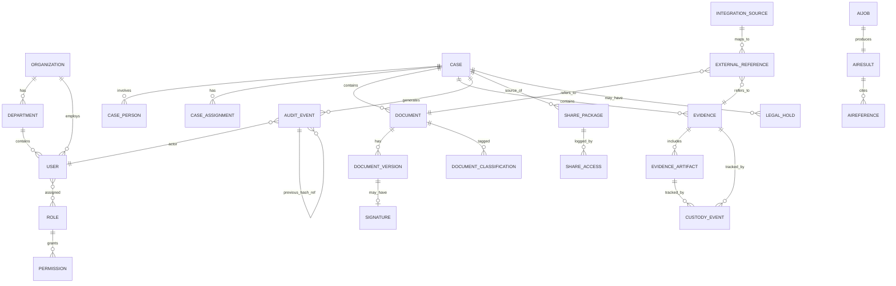
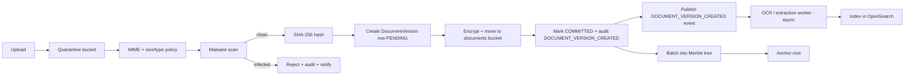
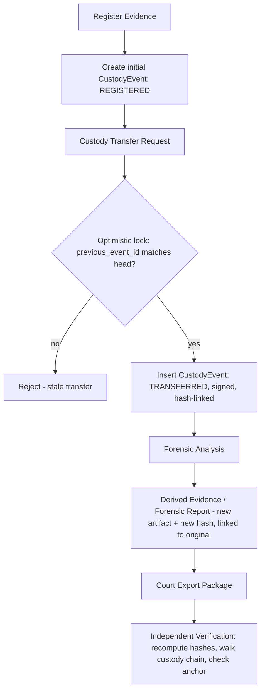
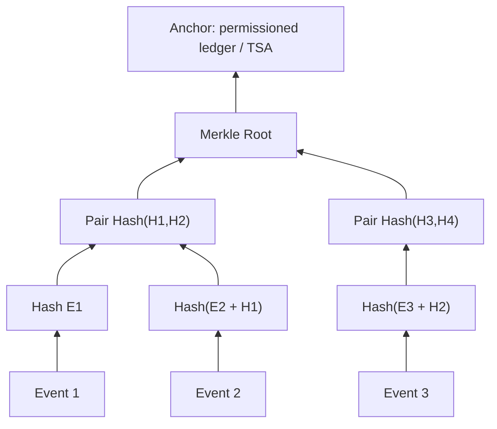
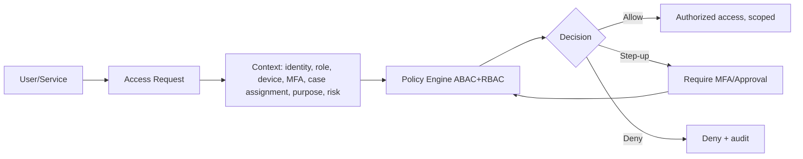
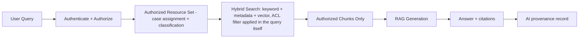
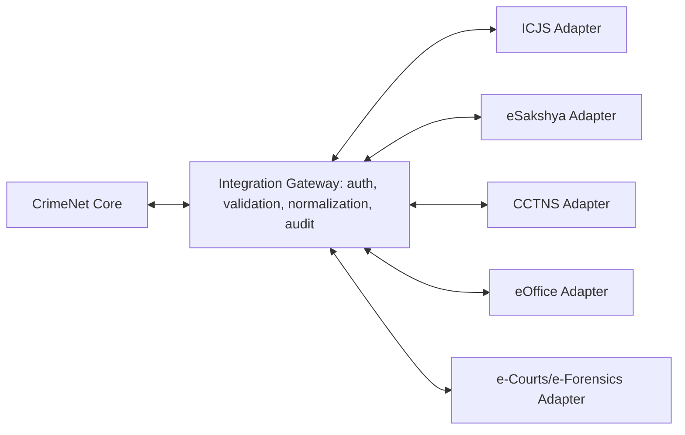

# CrimeNet — Backend Architecture & Implementation Plan
### A Zero-Trust Document & Evidence Provenance Fabric for the Criminal Justice Lifecycle

---

## 1. Executive Architecture

**What it is:** A case-centric, zero-trust platform that governs the *security, integrity, and lifecycle* of sensitive investigation/legal records — not a replacement for CCTNS, ICJS, eSakshya, eOffice, e-Courts, or e-Forensics, but a layer that sits alongside them.

**What problem it solves:** Existing systems capture records well but don't jointly guarantee: (a) who can see what and why, (b) that records weren't silently altered, (c) a provable custody trail for evidence, (d) controlled, time-bound sharing across departments, (e) AI/search that never leaks unauthorized content.

**Why CASE is the central aggregate:** Every document, evidence item, person, and permission decision only makes sense in the context of an investigation. Anchoring authorization, retention, and provenance to the Case (not the file) lets the system answer "who may see this, and why" consistently across thousands of documents without per-file policy sprawl.

**Why a modular monolith first:** At MVP/prototype scale, a modular monolith gives transactional consistency (one DB, one commit for document+audit+version), simpler ops, and faster delivery. Microservices would be justified only once independent scaling, independent deployment cadence, or team-boundary pressure actually exists — none of which apply yet. Splitting now would just distribute a small amount of logic across network calls and add consistency problems (see Critical Review).

**Where async is required:** Anything not needed to acknowledge the write immediately and not required for the core integrity chain: OCR, entity extraction, embeddings, AI/RAG, search indexing, Merkle anchoring. Everything on the *trust* critical path (hash generation, version creation, audit event write) stays **synchronous and transactional**.

**Where cryptography is required:** Content hash per document version (SHA-256), append-only hash-linked audit chain, periodic Merkle batching of audit events, and anchoring only the Merkle root externally (permissioned ledger or TSA).

**Where blockchain is useful / not useful:**
- Useful: as an independent, tamper-evident timestamp for a Merkle root (proves "this set of events existed, unmodified, at time T").
- Not useful: as a database, as a store for documents/PII/evidence, as a source of legal admissibility, as an access-control mechanism.

**Interoperability model:** Adapter-per-external-system behind a single Integration Gateway. Metadata-first federation — store external IDs/references locally, fetch authoritative content only when authorized and needed. Prototype uses mocked adapters.

---

## 2. Critical Architecture Review (before agreeing with anything)

| # | Issue | Why it matters | Correction |
|---|---|---|---|
| 1 | Blockchain temptation creep | Teams often end up wanting to put more "for trust" on-chain (docs, hashes-per-page, PII hashes that leak metadata) | Hard rule: **only Merkle roots + batch metadata** are anchored. Enforce via a dedicated `AnchorService` that is the *only* code path allowed to call the anchor adapter. |
| 2 | Case as single aggregate root can become a god-object | If Case owns everything, the Case service becomes a bottleneck and a merge-conflict machine | Case is an **aggregate identity**, not an aggregate *owner*. Documents/Evidence/Persons reference `case_id` as a foreign key but are managed by their own domain modules with their own repositories/services. |
| 3 | Storage/DB dual-write problem | Encrypt-and-store-to-MinIO then write-metadata-to-Postgres is two systems — a crash between them creates orphans | Use the **saga/outbox pattern**: write a `PENDING` document row first (with hash computed pre-upload), upload to MinIO, then mark `COMMITTED` in the same DB transaction as the audit event; a reconciliation job sweeps `PENDING` rows past a TTL. |
| 4 | Audit tamper-evidence via hash chain is necessary but not sufficient | A DBA with write access can rewrite the *whole* chain from a point forward, recompute all subsequent hashes, and it will still "verify" internally | The **Merkle anchor to an external, independently-controlled system** is what closes this gap — internal hash-chaining alone only proves internal self-consistency, not non-tampering. Say this explicitly in demos. |
| 5 | RAG permission leakage is the most common real-world mistake | If ACL filtering happens *after* retrieval (post-filter), the LLM has already "seen" restricted content in context, or worse, restricted docs get embedded at all | ACL metadata must be **indexed alongside vectors** in OpenSearch and applied as a **pre-retrieval filter** (bool filter clause), never a post-hoc step. Embeddings themselves must be regenerated/purged if a document's classification changes. |
| 6 | "Immutable version" claims must be enforced at more than one layer | App-level "don't allow edit" checks can be bypassed by a bug, a migration script, or direct DB access | Enforce immutability at 3 layers: (1) service-layer guard, (2) DB trigger that rejects UPDATE on sealed `document_version` rows (only INSERT allowed), (3) periodic integrity job that recomputes hashes and flags drift. |
| 7 | Overlapping identity concerns: RBAC in Keycloak vs ABAC in app | If roles live in Keycloak and attributes live in Postgres, policy decisions can disagree with token claims after a role change until token refresh | Keycloak issues **coarse RBAC** (role membership) in the JWT; **all fine-grained ABAC (case assignment, classification, purpose, risk)** is evaluated server-side per request against live DB state — never trust stale token claims for sensitive attributes. |
| 8 | Integration assumptions | Prompt assumes ICJS/CCTNS/eSakshya APIs may not exist yet | All adapters implement a common `ExternalSystemAdapter` interface; mock adapters are swapped for real ones via Spring profiles/config only — no application code changes. |
| 9 | Unrealistic production claims | Docs correctly avoid "DPDP compliant" but a dev team under deadline pressure will drift back to safe-sounding but false claims | Bake compliance language into a single `LEGAL_DISCLAIMERS.md` referenced by API docs and UI, not decided ad hoc per screen. |
| 10 | Watermarking/no-download "enforcement" is inherently client-trust-limited | A view-only, watermarked PDF viewer can still be screenshotted | Be explicit in threat model: these are **deterrent/traceability controls**, not prevention controls. Document this rather than overclaiming. |

---

## 3. Domain Model (core entities)



### Entity summary (purpose / mutability / sensitivity)

| Entity | Purpose | Mutable? | Sensitivity |
|---|---|---|---|
| Organization | Tenant boundary (state/dept/agency) | Mutable | Low |
| Department | Sub-org scoping for ABAC | Mutable | Low |
| User | Identity mirror of Keycloak subject | Mutable | Medium |
| Role / Permission | Coarse RBAC | Mutable (admin only) | Medium |
| Policy | ABAC rule definitions | Mutable (admin only, versioned) | High |
| Case | Central aggregate | Mutable (status transitions only) | High |
| CasePerson | Victim/Witness/Accused link, PII | Mutable, access-restricted | Critical |
| CaseAssignment | Who is assigned to a case | Mutable | Medium |
| Document | Logical document identity | Immutable identity, mutable status | Depends on classification |
| DocumentVersion | Sealed content snapshot | **Immutable once sealed** | Depends on classification |
| Evidence | Evidence record | Mostly immutable | Critical |
| EvidenceArtifact | Physical/digital artifact under an Evidence record | Immutable once registered | Critical |
| CustodyEvent | One custody transfer | **Append-only, immutable** | Critical |
| Signature / Certificate | Cryptographic signing metadata | Immutable | High |
| AuditEvent | System-wide append-only log | **Append-only, immutable** | Critical |
| SecurityEvent | Security-specific subset (denials, anomalies) | Append-only | Critical |
| SharePackage / ShareAccess | Controlled external sharing | Mutable (revocation), access log append-only | High |
| RetentionPolicy / LegalHold | Lifecycle & deletion governance | Mutable (policy), LegalHold blocks deletion | High |
| AIJob / AIResult / AIReference | AI provenance | Immutable once completed | Medium |
| IntegrationSource / ExternalReference / SyncJob | Federation with external systems | Mutable | Medium |

---

## 4. PostgreSQL Database Design (key tables)

### 4.1 Design principles
- Every table: `id UUID PK`, `org_id UUID` (tenant boundary), `created_at`, `created_by`, soft-delete via `status` enum (never hard DELETE on sensitive tables).
- `document_version` and `custody_event` and `audit_event` are **INSERT-only** — enforced via DB trigger, not just app code.
- Foreign keys everywhere; no orphaned evidence/document rows.
- Sensitive PII (victim/witness identity) isolated into `case_person` with row-level security (RLS) policies keyed to case assignment.

### 4.2 Core DDL (representative subset)

```sql
CREATE TABLE organization (
    id UUID PRIMARY KEY DEFAULT gen_random_uuid(),
    name TEXT NOT NULL,
    created_at TIMESTAMPTZ NOT NULL DEFAULT now()
);

CREATE TABLE app_user (
    id UUID PRIMARY KEY DEFAULT gen_random_uuid(),
    org_id UUID NOT NULL REFERENCES organization(id),
    keycloak_subject TEXT NOT NULL UNIQUE,
    department_id UUID REFERENCES department(id),
    display_name TEXT NOT NULL,
    status TEXT NOT NULL DEFAULT 'ACTIVE',
    created_at TIMESTAMPTZ NOT NULL DEFAULT now()
);
CREATE INDEX idx_user_org ON app_user(org_id);

CREATE TABLE case_record (
    id UUID PRIMARY KEY DEFAULT gen_random_uuid(),
    org_id UUID NOT NULL REFERENCES organization(id),
    case_number TEXT NOT NULL UNIQUE,          -- e.g. CASE-2026-UP-004281
    fir_id TEXT,
    icjs_case_id TEXT,
    classification TEXT NOT NULL DEFAULT 'STANDARD', -- STANDARD | SENSITIVE
    status TEXT NOT NULL DEFAULT 'ACTIVE',
    created_by UUID NOT NULL REFERENCES app_user(id),
    created_at TIMESTAMPTZ NOT NULL DEFAULT now()
);
CREATE INDEX idx_case_org_status ON case_record(org_id, status);
CREATE INDEX idx_case_classification ON case_record(classification);

CREATE TABLE case_assignment (
    id UUID PRIMARY KEY DEFAULT gen_random_uuid(),
    case_id UUID NOT NULL REFERENCES case_record(id),
    user_id UUID NOT NULL REFERENCES app_user(id),
    role_in_case TEXT NOT NULL,
    assigned_at TIMESTAMPTZ NOT NULL DEFAULT now(),
    UNIQUE(case_id, user_id, role_in_case)
);
CREATE INDEX idx_assignment_user ON case_assignment(user_id);

CREATE TABLE document (
    id UUID PRIMARY KEY DEFAULT gen_random_uuid(),
    case_id UUID NOT NULL REFERENCES case_record(id),
    business_id TEXT NOT NULL UNIQUE,          -- DOC-UP-2026-001821
    doc_type TEXT NOT NULL,
    classification TEXT NOT NULL DEFAULT 'STANDARD',
    current_version_id UUID,                   -- FK set after first version
    status TEXT NOT NULL DEFAULT 'ACTIVE',      -- ACTIVE|SEALED|ARCHIVED|LEGAL_HOLD
    created_by UUID NOT NULL REFERENCES app_user(id),
    created_at TIMESTAMPTZ NOT NULL DEFAULT now()
);
CREATE INDEX idx_document_case ON document(case_id);

CREATE TABLE document_version (
    id UUID PRIMARY KEY DEFAULT gen_random_uuid(),
    document_id UUID NOT NULL REFERENCES document(id),
    version_no INT NOT NULL,
    content_hash TEXT NOT NULL,                 -- SHA-256 hex
    object_key TEXT NOT NULL,                   -- MinIO key
    size_bytes BIGINT NOT NULL,
    mime_type TEXT NOT NULL,
    created_by UUID NOT NULL REFERENCES app_user(id),
    created_at TIMESTAMPTZ NOT NULL DEFAULT now(),
    UNIQUE(document_id, version_no)
);
CREATE INDEX idx_docversion_document ON document_version(document_id);
CREATE INDEX idx_docversion_hash ON document_version(content_hash);

-- Enforce append-only
CREATE OR REPLACE FUNCTION reject_update_delete() RETURNS TRIGGER AS $$
BEGIN
    RAISE EXCEPTION 'Table % is append-only', TG_TABLE_NAME;
END;
$$ LANGUAGE plpgsql;

CREATE TRIGGER document_version_no_update
BEFORE UPDATE OR DELETE ON document_version
FOR EACH ROW EXECUTE FUNCTION reject_update_delete();

CREATE TABLE evidence (
    id UUID PRIMARY KEY DEFAULT gen_random_uuid(),
    case_id UUID NOT NULL REFERENCES case_record(id),
    evidence_code TEXT NOT NULL UNIQUE,          -- E-019
    source TEXT NOT NULL,
    source_device TEXT,
    collected_by UUID NOT NULL REFERENCES app_user(id),
    collected_at TIMESTAMPTZ NOT NULL,
    location TEXT,
    initial_hash TEXT NOT NULL,
    classification TEXT NOT NULL DEFAULT 'STANDARD',
    created_at TIMESTAMPTZ NOT NULL DEFAULT now()
);
CREATE INDEX idx_evidence_case ON evidence(case_id);

CREATE TABLE custody_event (
    id UUID PRIMARY KEY DEFAULT gen_random_uuid(),
    evidence_id UUID NOT NULL REFERENCES evidence(id),
    from_actor UUID REFERENCES app_user(id),
    to_actor UUID NOT NULL REFERENCES app_user(id),
    action TEXT NOT NULL,                        -- REGISTERED|TRANSFERRED|ANALYZED|...
    purpose TEXT,
    location TEXT,
    event_hash TEXT NOT NULL,
    previous_event_id UUID REFERENCES custody_event(id),
    signature TEXT,
    created_at TIMESTAMPTZ NOT NULL DEFAULT now()
);
CREATE INDEX idx_custody_evidence_time ON custody_event(evidence_id, created_at);

CREATE TRIGGER custody_event_no_update
BEFORE UPDATE OR DELETE ON custody_event
FOR EACH ROW EXECUTE FUNCTION reject_update_delete();

CREATE TABLE audit_event (
    id UUID PRIMARY KEY DEFAULT gen_random_uuid(),
    event_type TEXT NOT NULL,
    actor_id UUID REFERENCES app_user(id),
    resource_id UUID,
    case_id UUID REFERENCES case_record(id),
    payload JSONB NOT NULL,
    payload_hash TEXT NOT NULL,
    previous_event_hash TEXT,
    event_hash TEXT NOT NULL,
    created_at TIMESTAMPTZ NOT NULL DEFAULT now()
);
CREATE INDEX idx_audit_case_time ON audit_event(case_id, created_at);
CREATE INDEX idx_audit_type_time ON audit_event(event_type, created_at);

CREATE TRIGGER audit_event_no_update
BEFORE UPDATE OR DELETE ON audit_event
FOR EACH ROW EXECUTE FUNCTION reject_update_delete();

CREATE TABLE legal_hold (
    id UUID PRIMARY KEY DEFAULT gen_random_uuid(),
    case_id UUID NOT NULL REFERENCES case_record(id),
    reason TEXT NOT NULL,
    applied_by UUID NOT NULL REFERENCES app_user(id),
    applied_at TIMESTAMPTZ NOT NULL DEFAULT now(),
    released_at TIMESTAMPTZ
);
CREATE INDEX idx_legalhold_case_active ON legal_hold(case_id) WHERE released_at IS NULL;
```

### 4.3 Transaction boundaries

**"Create document version" must be one atomic unit:**
```
BEGIN
  INSERT document_version (hash, object_key=PENDING, ...)
  → call MinIO upload (outside DB tx)
  UPDATE document_version SET object_key = <final>, status = COMMITTED
  UPDATE document SET current_version_id = new_version.id
  INSERT audit_event (DOCUMENT_VERSION_CREATED)
COMMIT
```
Because MinIO isn't transactional with Postgres, use the **outbox pattern**: the DB row is the source of truth; a reconciliation worker verifies the MinIO object exists for every `COMMITTED` row and quarantines/flags mismatches.

**Custody transfer** must atomically: insert `custody_event`, verify `previous_event_id` matches the current head (optimistic concurrency — reject if stale), write `audit_event`. Use `SELECT ... FOR UPDATE` on the evidence row to serialize concurrent transfer attempts.

---

## 5. MinIO / Object Storage Architecture

```
crimenet-quarantine/     -- unscanned uploads, short TTL, auto-purge on fail
crimenet-documents/      -- sealed document versions, org/case partitioned
crimenet-evidence/       -- evidence artifacts, stricter access policy
crimenet-court-packages/ -- generated export bundles, time-limited
crimenet-archive/        -- cold tier, WORM/object-lock enabled
```

Key naming: `{org_id}/{case_id}/{document_id}/{version_no}/{content_hash}.enc`

Rules:
- Every object server-side encrypted (SSE) with a per-org KMS key.
- **No bucket or object is ever public.** All client access goes through the API, which issues short-lived **pre-signed URLs** (60–300s) after authorization passes — never raw MinIO endpoints or credentials to the frontend.
- `crimenet-archive` and `crimenet-evidence` use MinIO **Object Lock (WORM)** so legal-hold items literally cannot be deleted even by an admin, independent of the app-level `legal_hold` table — this is the correction to the naive "5 buckets" starting design: without Object Lock, "immutability" is only a promise, not a guarantee.
- Quarantine bucket has a lifecycle rule to auto-expire failed/abandoned uploads after 24h.

---

## 6. Document Lifecycle



- **Idempotency**: client sends an `Idempotency-Key` header; duplicate uploads with the same key + same hash return the existing version instead of creating a new one.
- **Sealed = immutable**: `document.status = SEALED` blocks any further writes to that version; a new upload always creates `version_no + 1`, never touches prior rows (enforced by DB trigger in §4.2).

---

## 7. Evidence & Chain of Custody



Tamper prevention for custody history: every `custody_event.event_hash = SHA256(previous_event_hash + canonical_payload)`, rows are DB-trigger-protected against UPDATE/DELETE, and each batch is included in the same Merkle-anchoring pipeline as audit events — so rewriting custody history would also break the anchored Merkle proof.

---

## 8. Cryptographic Provenance



- **Document hash**: SHA-256 over raw file bytes before encryption, stored per version.
- **Audit hash chain**: each `audit_event.event_hash = SHA256(canonical_json(payload) + previous_event_hash)`.
- **Merkle batching**: every N minutes (or N events), batch unanchored events, build a Merkle tree, anchor only the root + batch_id + timestamp.
- **Verification**: recompute event hashes → rebuild tree → compare root to anchor. A mismatch anywhere flags `INTEGRITY_FAILURE` without revealing which record specifically changed to unauthorized verifiers (only to authorized auditors, via the chain, which they can walk).
- **Never anchored**: file contents, PII, victim/witness identity, case content of any kind.

---

## 9. Audit Architecture

- `audit_event` is INSERT-only (DB trigger), hash-chained, batched into Merkle trees, anchored.
- `SecurityEvent` is a filtered view/subset (POLICY_DENIED, BREAK_GLASS_*, anomaly flags) surfaced to a security dashboard with lower latency requirements than general audit review.
- Even a DBA with table access cannot **silently** rewrite history: any edit breaks the hash chain from that point forward, and the next anchor verification (or an on-demand one) will show the recomputed root doesn't match the externally anchored root — the tamper is provable, even if not by trigger alone (since a sufficiently privileged DBA could disable triggers). This is why the anchor step is non-negotiable, not decorative.

---

## 10. Zero-Trust Authorization



- **Keycloak** issues JWTs with coarse role claims (`ADMIN`, `INVESTIGATOR`, `SUPERVISOR`, `FORENSIC_OFFICER`, `PROSECUTOR`, `AUDITOR`, `COURT_USER`) plus `department`, `mfa_level`, `device_trust` (from a device-registration claim mapper).
- **Fine-grained ABAC** (case assignment, classification, purpose, current risk score) is evaluated **per-request in the application**, via a dedicated `PolicyEvaluationService` — not delegated fully to Keycloak, since case assignment changes far more often than role membership and must never be stale.
- Recommendation: **custom Spring-based policy service**, not Keycloak Authorization Services or an external engine like OPA for v1 — because case-assignment lookups need a live DB join anyway, and adding OPA now is exactly the kind of premature complexity flagged in the critical review. Revisit OPA only if policy complexity outgrows in-process evaluation.

Example JWT claims:
```json
{
  "sub": "USR-184",
  "roles": ["INVESTIGATOR"],
  "department": "CYBER_CRIME",
  "mfa_level": "AAL2",
  "device_trust": "MANAGED",
  "org_id": "ORG-UP-POLICE"
}
```

---

## 11. Secure Sharing & Break-Glass

**Sharing flow**: select case/docs → create `SharePackage` (recipient, purpose, scope, expiry, rights, MFA-required, watermark flag) → recipient auth + MFA → policy check → view-only/watermarked render via short-lived signed URL → every access logged to `ShareAccess` → auto-expiry or explicit revocation. No public links ever — every share requires an authenticated recipient identity.

**Break-glass**: reason required → step-up MFA → risk evaluation → time-boxed, restricted (view-only, watermarked) grant → automatic expiry → mandatory supervisor notification + `BREAK_GLASS_GRANTED`/`BREAK_GLASS_REQUESTED` audit events. Implemented as a short-lived row in a `break_glass_grant` table that the policy engine checks and that a scheduled job auto-expires.

---

## 12. Retention & Legal Hold

```
ACTIVE → SEALED → ARCHIVED → RETENTION REVIEW → DISPOSITION
                                                     ▲
                              LEGAL HOLD ────────────┘ (blocks this transition entirely)
```

Deletion/disposition is never a direct DELETE — it's a workflow requiring approval, checked against `legal_hold` (any unreleased hold on the case blocks disposition at the service layer **and** the object storage layer via Object Lock).

---

## 13. RabbitMQ & Python Workers

| Exchange/Queue | Purpose | Sync/Async |
|---|---|---|
| `document.uploaded` | Trigger scan pipeline | Async |
| `document.version.created` | Trigger OCR/index/anchor batch | Async |
| `ocr.requested` / `ocr.completed` | OCR worker job | Async |
| `embedding.requested/completed` | Embedding worker | Async |
| `ai.analysis.requested/completed` | AI/RAG worker | Async |
| `integrity.batch.ready` / `anchor.requested/completed` | Merkle + anchoring | Async |

- All queues have a **dead-letter queue** with exponential backoff retry (3–5 attempts), then manual review.
- Every message carries a `correlation_id` (e.g. `TRC-928172`) propagated through API → queue → worker → search → audit for tracing.
- Workers are **idempotent by job ID**: reprocessing the same `job_id` is a no-op if a result already exists.
- Python workers authenticate to Spring Boot's internal API via a service-account JWT (client-credentials grant from Keycloak), never using end-user tokens.
- AI/OCR workers receive only **object references + short-lived signed URLs**, never raw credentials, and only for documents the requesting job is authorized to touch (authorization decided *before* the job is queued).

---

## 14. OpenSearch & Permission-Aware RAG



Every OpenSearch document includes ACL fields (`case_id`, `classification`, `authorized_roles[]`, `authorized_user_ids[]`) and every query includes a **mandatory `bool filter`** on those fields built server-side from the requester's context — restricted documents are excluded from the candidate set before ranking/embedding similarity is even computed, not filtered from results afterward.

---

## 15. AI Provenance

Every `AIJob` → `AIResult` records: user, query, model + version, timestamp, retrieved document IDs + versions, retrieved chunk references, generated response. AI is read/summarize/classify/suggest only — it has no write path to `document`, `document_version`, `evidence`, or `custody_event` tables.

---

## 16. Integration Gateway



All adapters implement a common interface (`fetchReference`, `pushReference`, `healthCheck`). Prototype ships **mock adapters** returning realistic sample payloads; switching to real ones is a config/credential change only, provided the real API's schema maps cleanly to the adapter's normalization contract — schema drift is the one thing that will require adapter code changes.

---

## 17. REST API (representative)

| Method | Path | Auth | Notes |
|---|---|---|---|
| POST | `/api/v1/cases` | INVESTIGATOR+ | Creates case, audit `CASE_CREATED` |
| GET | `/api/v1/cases/{id}` | case-assigned | ABAC checked |
| POST | `/api/v1/cases/{id}/documents` | case-assigned | Multipart upload → lifecycle pipeline |
| GET | `/api/v1/documents/{id}/versions` | case-assigned | Immutable list |
| GET | `/api/v1/documents/{id}/integrity` | case-assigned/AUDITOR | Recompute + compare hash |
| POST | `/api/v1/evidence` | FORENSIC_OFFICER/INVESTIGATOR | Registers evidence |
| POST | `/api/v1/evidence/{id}/custody` | assigned + signature | Optimistic-lock transfer |
| POST | `/api/v1/shares` | case-assigned | Creates SharePackage |
| POST | `/api/v1/ai/query` | case-assigned | Permission-aware RAG only |
| GET | `/api/v1/audit` | AUDITOR | Read-only, paginated, filterable |
| POST | `/api/v1/integrations/{system}/sync` | ADMIN | Triggers adapter sync job |

All mutating endpoints: idempotency-key support, explicit audit event, explicit transaction boundary, explicit error taxonomy (400/401/403/404/409/422/500).

---

## 18. Spring Boot Project Structure (feature-oriented)

```
backend/src/main/java/com/crimenet/
├── identity/          (users, keycloak sync)
├── organization/
├── policy/            (RBAC+ABAC engine)
├── cases/
├── documents/
├── evidence/
├── provenance/        (hashing, merkle, anchoring)
├── workflow/
├── sharing/
├── retention/
├── search/            (OpenSearch client, RAG orchestration)
├── audit/
├── security/          (config, filters, JWT)
├── signatures/
├── ai/                (job orchestration, provenance)
├── integrations/       (gateway + adapters)
├── common/            (shared DTOs, exceptions, utils)
└── infrastructure/    (MinIO, RabbitMQ, Redis config)
```
Feature-oriented over layer-oriented: each package is independently testable and reviewable, matches the domain modules in §3, and keeps blast radius small when a module changes.

---

## 19. Security Threat Model (abridged)

| Threat | Control | Detection |
|---|---|---|
| Stolen credentials | MFA, short sessions, device trust | Anomalous login alerts |
| Insider misuse | ABAC + case assignment + purpose logging | POLICY_DENIED audit, anomaly rules |
| Document tampering | Immutable versions, SHA-256, DB triggers | Integrity verification job |
| Audit tampering | Append-only + hash chain + external anchor | Anchor mismatch alert |
| Unauthorized export | Policy engine, watermark, expiry | Bulk-download alert |
| Malicious upload | Quarantine, MIME check, malware scan | Scan-fail audit |
| AI leakage | Pre-retrieval ACL filter | RAG-source audit trail |
| Ransomware | Immutable/WORM backups, isolated creds | Backup integrity checks |

Also required: TLS 1.3 everywhere, secrets in a vault (not env files in prod), least-privilege DB roles, parameterized queries only (JPA), CORS locked to known origins, rate limiting on auth and export endpoints, path-traversal-safe object keys (UUID-based, never user-supplied filenames).

---

## 20. Observability, Failure & Recovery (summary)

- Correlation IDs propagated end-to-end; structured JSON logs; metrics on queue depth, auth failures, bulk downloads, integrity failures, anchor backlog.
- **Dual-write failure (Postgres row exists, MinIO object doesn't)**: version stays `PENDING`; reconciliation job either retries upload or marks `FAILED` + audit + alert — never silently promoted to `COMMITTED`.
- **Duplicate upload**: idempotency key + content-hash dedup returns existing version.
- **Duplicate custody transfer**: optimistic lock on `previous_event_id` rejects the second submission.
- **RabbitMQ/OCR/OpenSearch/AI outage**: core document lifecycle (upload → hash → seal → audit) is unaffected since those stages are synchronous and DB-committed; only search/AI features degrade until workers recover — messages remain queued.
- **Prototype vs production DR targets**: prototype = daily backups, best-effort RTO; production = point-in-time recovery for Postgres, versioned+locked MinIO backups, documented RPO/RTO agreed with stakeholders (not invented here).

---

## 21. Testing Strategy (summary)

Unit (hashing, versioning, policy evaluation, custody transitions) → Integration (Postgres/MinIO/RabbitMQ/OpenSearch/Keycloak via Testcontainers) → Security (broken object-level auth, token replay, upload attacks, export abuse) → Integrity (tamper a version/audit/custody row externally and confirm detection) → End-to-end demo test running the full Case 4281 storyline.

---

## 22. Implementation Roadmap

| Phase | Scope | Priority |
|---|---|---|
| 1 | Foundation: Spring Boot, Postgres, Keycloak, Docker, org/user/role, case CRUD | First |
| 2 | Document lifecycle: upload, quarantine, hash, version, MinIO, audit | First |
| 3 | Evidence + custody | First |
| 4 | RabbitMQ + async OCR/extraction | Second |
| 5 | OpenSearch (metadata+keyword first, semantic later) | Second |
| 6 | Secure sharing + break-glass | Second |
| 7 | Cryptographic provenance: hash chain, Merkle, anchor | Second (critical for demo) |
| 8 | AI/RAG with permission-aware retrieval | Third |
| 9 | Integration gateway (mocks) | Third |
| 10 | Hardening: threat testing, observability, DR, perf | Postponed until 1–9 are solid |

**Do first:** Case + Document lifecycle + Audit + Hash chain (this alone gives a working, demoable tamper-evidence story). **Deliberately postpone:** semantic search/embeddings, real government adapters, Kubernetes, multi-region DR — none are needed to prove the core thesis.

---

## 23. End-to-End Demo (Case CASE-2026-UP-004281)

Case created → FIR uploaded → scan → hash → version sealed → OCR → indexed → sensitive witness statement (elevated policy) → Evidence E-019 registered → custody transferred → forensic report linked → time-bound secure package to prosecutor → auditor reviews timeline → integrity verifier confirms hashes/custody/anchor.

**Three killer demonstrations:**
1. **Tampering** — modify a sealed file's bytes outside the system → recomputed hash mismatches stored hash → `INTEGRITY_FAILURE`.
2. **Insider misuse** — investigator queries an unassigned sensitive case → policy engine denies → `POLICY_DENIED` audited.
3. **AI isolation** — authorized query returns cited results; unauthorized query for a restricted witness statement never has that document enter retrieval at all (pre-filtered, not post-hidden).

---

## 24. Architectural Problems To Fix Before Coding

| Severity | Problem | Fix |
|---|---|---|
| CRITICAL | Dual-write between Postgres and MinIO without a reconciliation mechanism | Outbox pattern + reconciliation job (§4.3) |
| CRITICAL | RAG permission leakage if ACL filtering is applied after retrieval | Pre-retrieval ACL filter baked into every OpenSearch query (§14) |
| HIGH | Believing the internal hash chain alone proves non-tampering | Explicit reliance on external Merkle anchor for provable tamper-evidence (§9) |
| HIGH | Treating Keycloak role claims as sufficient for fine-grained decisions | Server-side ABAC evaluation against live case-assignment data, every request (§10) |
| HIGH | "Immutable" documents enforced only in application code | DB triggers + MinIO Object Lock as defense-in-depth (§4.2, §5) |
| MEDIUM | Custody transfer race conditions under concurrent submission | Optimistic locking on `previous_event_id` + row-level lock (§13/§7) |
| MEDIUM | Overclaiming legal admissibility or compliance | Centralized disclaimer language, never per-screen ad hoc (§2 #9) |
| LOW | Premature microservice splitting temptation | Stay modular monolith until a concrete scaling/team trigger exists (§1) |

---

## 25. Final Recommended Architecture (one paragraph)

Ship a Spring Boot modular monolith over PostgreSQL + MinIO + OpenSearch + Redis + RabbitMQ, with Python workers for OCR/AI, Keycloak for identity, and a strict split between fast synchronous writes (upload → hash → seal → audit, always transactional) and slow asynchronous enrichment (OCR, indexing, embeddings, anchoring). Authorization is zero-trust and evaluated per-request against live case assignment and classification, never solely from JWT claims. Cryptographic trust rests on per-version SHA-256 hashes, an append-only hash-linked audit chain, and periodic Merkle-root anchoring to an external, independently controlled ledger or timestamp authority — with nothing sensitive ever leaving the system boundary. Build and demo the Case → Document → Evidence → Custody → Share → AI-query → Audit → Anchor path first; defer semantic search, real government integrations, and multi-region DR until that core loop is solid and proven.
