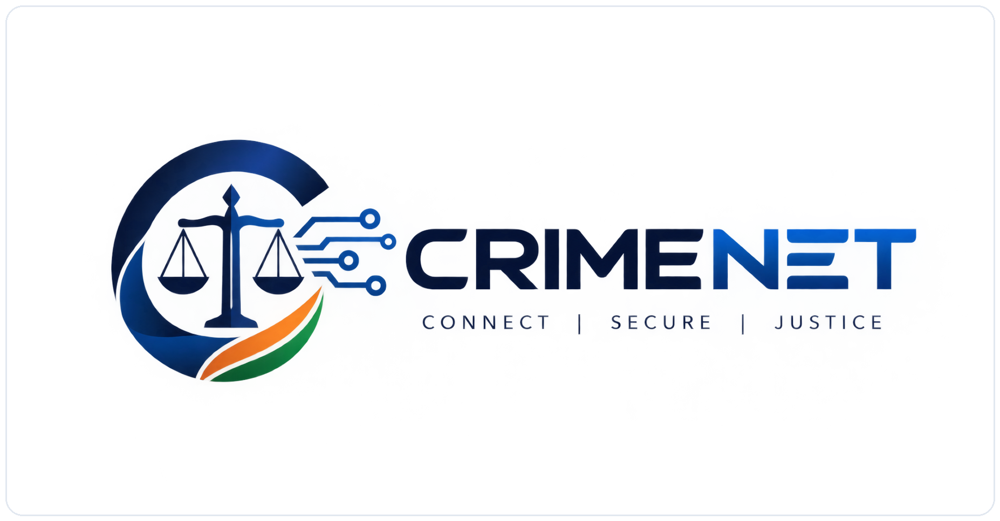

<p align="center">
  
</p>

<h1 align="center">CrimeNet: Zero-Trust Law Enforcement & Judicial Document Provenance Fabric</h1>

<p align="center">
  <strong>A Case-Centric Security Architecture for National Legal & Investigation Document Management</strong><br>
  <em>Compliant with Section 65B Bharatiya Sakshya Adhiniyam (BSA) 2023 • Cryptographic Chain of Custody • Blockchain Anchored</em>
</p>

<p align="center">
  
  
  
  
  
  
</p>

---

## 🏛️ Executive Summary

Modern criminal justice systems handle enormous volumes of sensitive documents throughout a case's lifecycle:
* **FIRs and Police Case Diaries**
* **Investigation Records & Witness Statements**
* **Charge Sheets & Supplementary Filings**
* **Forensic Lab Reports & Ballistics Examinations**
* **Court Exhibits, Judgments & Legal Notices**

**CrimeNet** establishes an unassailable digital layer of truth that prevents document tampering, enforces strict version control, guarantees unbroken chain of custody, isolates victim/witness identities via Row-Level Security (RLS) and AES-256-GCM encryption, and monitors police assets throughout their operational lifecycle.

---

## 📐 System Architecture

```
                                  [ CRITICAL INFRASTRUCTURE CLIENTS ]
                                                   │
                  ┌────────────────────────────────┴────────────────────────────────┐
                  ▼                                                                 ▼
      [ Officer Field Mobile App ]                                     [ Central Portal Console ]
      (iOS iPhone 16 / Android Pixel 9)                                (Institutional Clearance Gate)
                  │                                                                 │
                  └───────────────────────────────┬─────────────────────────────────┘
                                                  │ HTTPS / TLS 1.3
                                                  ▼
                                      [ SPRING BOOT API GATEWAY ]
                                  (Stateless JWT + ABAC Engine)
                                                  │
                ┌─────────────────────────────────┼─────────────────────────────────┐
                ▼                                 ▼                                 ▼
      [ PostgreSQL 16 Database ]        [ MinIO S3 Object Storage ]      [ RabbitMQ & OpenSearch ]
      • Row-Level Security (RLS)        • Quarantine Bucket              • Dead-Letter Exchange (DLQ)
      • Append-Only DB Triggers         • Committed Documents Bucket     • Async Malware Inspection
      • AES-256-GCM Column PII          • Evidence Artifacts Bucket      • Zero-Trust Search Filter
      • Pessimistic Custody Locks       • Archive / Cold Storage         • TRC-* Correlation Tracing
                │                                 │
                └─────────────────────────────────┴─────────────────────────────────┐
                                                                                    ▼
                                                                        [ SMART CONTRACT ANCHOR ]
                                                                        • Ethereum Sepolia / Polygon
                                                                        • Merkle Batch Root Hashes
                                                                        • Non-Repudiation Proof
```

---

## 🛡️ Security & Integrity Guarantees

### 1. Document Versioning & Immutability
* **Multi-Version Upload Pipeline**: Document revisions (e.g., Supplementary Charge Sheets, Updated Lab Reports) are uploaded via `POST /api/v1/documents/{id}/versions`.
* **Database Append-Only Triggers**: PostgreSQL triggers (`document_version_no_update`, `custody_event_no_update`, `audit_event_no_update`, `share_access_no_update`) execute `reject_update_delete()` to reject any SQL `UPDATE` or `DELETE` on committed rows.
* **Cryptographic Hash Anchoring**: Each version receives a content SHA-256 hash. Previous versions remain permanent and downloadable by their specific version ID.

### 2. Physical & Digital Evidence Custody
* **Pessimistic Row-Level Locking**: Concurrent custody handoffs execute under `@Lock(LockModeType.PESSIMISTIC_WRITE)` (`SELECT ... FOR UPDATE`), eliminating TOCTOU race conditions and custody split-brain forks.
* **Mandatory Chain Verification**: `previousEventId` is mandatory and must match the current chain head.
* **Per-Officer Digital Signatures**: Every custody transfer is signed using dedicated per-officer RSA-4096 cryptographic keypairs.

### 3. Row-Level Security (RLS) & PII Encryption
* **PostgreSQL RLS**: Activated on `case_person` with `FORCE ROW LEVEL SECURITY`. Unassigned officers receive zero rows directly from PostgreSQL.
* **AES-256-GCM Encryption**: Sensitive citizen identifiers (`id_number_encrypted`, `contact_encrypted`, `address_encrypted`) are encrypted before database insertion via `EncryptedStringConverter`.

### 4. Police Asset Lifecycle Management
* Complete monitoring of departmental equipment:
  * **Weapons** (Service pistols, tactical rifles)
  * **Bodycams** (Axon Body 3 units, footage logs)
  * **Vehicles** (Patrol vehicles, response vans)
  * **Forensic Kits** (Crime scene collection units)
* Tracks registration, custodian assignment, armory return, and status transitions with hash-chained audit trails.

### 5. On-Chain Merkle Provenance
* Audit events are batched every 5 minutes into a Merkle tree.
* Only the cryptographic **Merkle Root Hash** and batch metadata are anchored to EVM smart contracts (`DocumentProvenanceAnchor.sol`). **Zero PII, case details, or file bytes are ever published on-chain.**

---

## 📱 Applications & Testing Interfaces

### 1. Central Government Clearance Portal
* **Location**: `http://localhost:8080/` (or `backend/src/main/resources/static/index.html`)
* **Features**:
  * **Institutional Clearance Login Gate**: Enter Officer Badge ID, Hardware PKI PIN, and Department, or select from one-click demo clearance profiles.
  * **Case 1457 Dossier**: Active FIR records, statutory charges, assigned agencies, and live RLS clearance verification.
  * **Document Versioning Workspace**: Upload new revisions (v2), inspect SHA-256 hashes, and download pre-signed files.
  * **Evidence Vault**: Real-time chain of custody with pessimistic row-locking and RSA signature verification.
  * **Police Asset Manager**: Armory inventory tracking and inspection logs.
  * **Blockchain Explorer**: Live smart contract Merkle root anchors.

### 2. Field Investigation Mobile App
* **Location**: `http://localhost:8080/mobile/index.html` (or `mobile-app/index.html`)
* **Features**:
  * **Interactive Device Shell Toggle**:
    *  **Apple iOS Mode**: iPhone 16 Pro viewport (390 x 844 px) with Dynamic Island.
    * 🤖 **Google Android Mode**: Pixel 9 Pro viewport (412 x 892 px).
    * 📱 **Native Fullscreen Mode**: Responsive standalone layout for mobile device testing.
  * **Officer Biometric Authentication**: Simulated FaceID / Fingerprint clearance.
  * **Mobile Evidence Scanner**: Real-time camera & file upload simulator for scene exhibits.
  * **Custody Handoff**: Field custody transfer with cryptographic signature confirmation.

---

## ⚡ API Quick Reference

| Method | Endpoint | Description | Auth Required |
| :--- | :--- | :--- | :--- |
| `POST` | `/api/v1/cases/{caseId}/documents` | Upload new document (creates Version 1) | `DOCUMENT.CREATE` |
| `POST` | `/api/v1/documents/{id}/versions` | Upload new revision to document (Version 2+) | `DOCUMENT.UPDATE` |
| `GET` | `/api/v1/documents/{id}/versions` | List all historical versions of a document | `CASE.READ` |
| `GET` | `/api/v1/documents/{id}/download` | Generate 300s pre-signed SigV4 download URL | `CASE.READ` |
| `POST` | `/api/v1/evidence` | Register new physical/digital evidence item | `EVIDENCE.CREATE` |
| `POST` | `/api/v1/evidence/{id}/custody` | Transfer custody with pessimistic row lock | Active Custodian / Admin |
| `GET` | `/api/v1/evidence/{id}/chain` | Retrieve complete hash-linked custody chain | `CASE.READ` |
| `POST` | `/api/v1/assets` | Register new police asset in armory | `ASSET.MANAGE` |
| `POST` | `/api/v1/assets/{id}/assign` | Issue asset to an officer or case | `ASSET.ASSIGN` |
| `POST` | `/api/v1/assets/{id}/return` | Return asset to armory inventory | `ASSET.UPDATE` |
| `PATCH` | `/api/v1/assets/{id}/status` | Update operational or maintenance status | `ASSET.UPDATE` |
| `POST` | `/api/v1/shares` | Create secure time-bound share package | `SHARE.CREATE` |
| `POST` | `/api/v1/break-glass/request` | Request 30-min audited emergency access | `BREAK_GLASS` + MFA |
| `GET` | `/api/v1/provenance/batches` | View blockchain Merkle anchor batches | `AUDITOR` |

---

## 🚀 Getting Started

### Prerequisites
* **Java 21 JDK**
* **Docker & Docker Compose**
* **Maven 3.9+** (or bundled `mvnw.cmd`)

### 1. Start Infrastructure Services
```bash
docker-compose up -d postgres minio rabbitmq opensearch redis keycloak
```

### 2. Build and Run Backend
```bash
cd backend
mvnw.cmd package -DskipTests
java -jar target/crimenet-backend-0.1.0-SNAPSHOT.jar
```

### 3. Access Portal & Mobile App
* **Web Portal Console**: [http://localhost:8080/](http://localhost:8080/)
* **Field Mobile App**: [http://localhost:8080/mobile/index.html](http://localhost:8080/mobile/index.html)
* **Swagger API Documentation**: [http://localhost:8080/swagger-ui.html](http://localhost:8080/swagger-ui.html)

---

## ⚖️ Legal & Compliance Disclaimers
Please review [LEGAL_DISCLAIMERS.md](LEGAL_DISCLAIMERS.md) for jurisdictional evidentiary compliance guidelines under the Bharatiya Sakshya Adhiniyam (BSA) 2023 and Section 65B electronic admissibility certificates.
